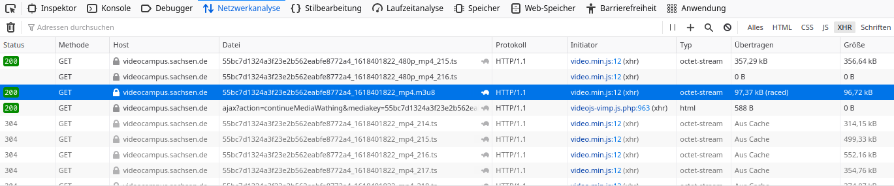

# VideoCampus Sachsen Downloader - Improved for AMD Graphics Cards
This is a fork of the [VideoCampus Sachsen Downloade by spylfy](https://github.com/spyfly/videocampus-sachsen-downloader).

This is a tool designed for downloading content from the [VideoCampus Sachsen](https://videocampus.sachsen.de/) and learning plattforms that rely on it, such as [Bildungsportal Sachsen - OPAL](https://bildungsportal.sachsen.de/opal).

With this tool you can download the lecture videos and learn at your own pace, at your place of choice and without the need for having an internet connection available.

If you enjoy using this tool, leave a star on GitHub.

## What is different?
It is a heavily improved version. It **downloads 16x time faster and encodes your video to space-saving [HEVC](https://de.wikipedia.org/wiki/High_Efficiency_Video_Coding) accelerated by your AMD Graphics Card**. This means: Great quality by only using ~300 MB for 90 minutes of video.

## What do I need to run your python script?
Not much. You will need:
- Linux
- Python 3.6 or higher with pip3 and ffmpeg
- If you want to profit from the lightning fast video encoding: AMD Radeon Series 400 or higher
- If you do not own such a graphics card replace ffmpeg inside the python file with the following line:`ffmpeg = ["ffmpeg", "-f", "concat", "-i", "ts_file.txt", "-map", "0", "-c:a", "copy", "-c:v", "libx265", "-crf", "25", "-preset", "slow", filename]`


## Installation
1. Install Python 3.6 (or higher), Pip3 and ffmpeg. For Debian based systems, it should look something like this `sudo apt install python3 python3-pip ffmpeg`
3. Clone this repo and enter the directory
4. Create a python venv `python3 -m venv venv`, because you don't want to install pip packages system-wide
5. Start your venv `source venv/bin/activate`
6. Run `pip3 install joblib`


## CLI Usage
1. Start your venv `source venv/bin/activate`
2. Run `python3 vcs-downloader.py [Download-URL] [Target-Filename]` or simply `python3 vcs-downloader.py`. Then you will be prompted to enter URL and filename. Your Filename **must** contain *.mp4*

## Retrieving the video stream URL
1. Open the console of your browser (F12) and select the Network Inspector Tab
2. Select the XHR request type and start playing the Video
3. Now right click one of the marked URL with a *.m3u8* file extension and copy the URL as seen on the image below.



## Authentication
Sometimes the application may prompt you for authentication. In that case,  just copy the PHPSESSID from your browser, so that the downloader can authenticate as well.


## FAQ
### OMG my video looks horrible green
Yeah, this can happen on some hardware. This will be fixed soon. Until this happens, you can disable the hardware acceleration by replacing ffmpeg inside the python file with the following line:
```python
ffmpeg = ["ffmpeg", "-f", "concat", "-i", "ts_file.txt", "-map", "0", "-c:a", "copy", "-c:v", "libx265", "-crf", "25", "-preset", "slow", filename]
```

### I don't have an AMD Radeon Series 400 or higher but want to use your tool
Look above.
